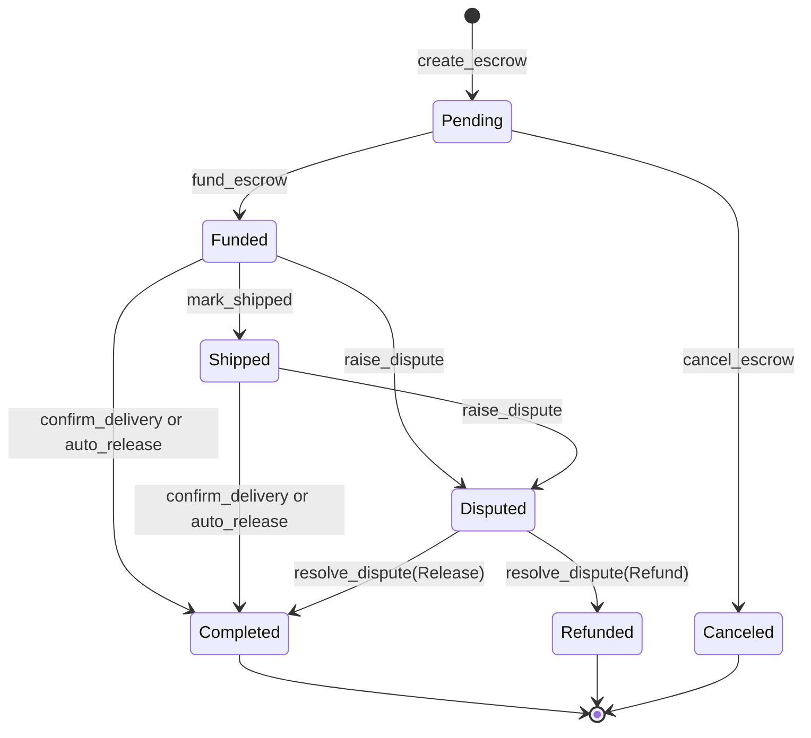

# Escrow State Machine

This document is the formal lifecycle specification for `EscrowState`. The enum
is defined in `contracts/escrow/src/types.rs`.

## States

| State | Meaning | Terminal |
|---|---|---|
| `Pending` | Escrow terms exist, but buyer funds have not been locked. | No |
| `Funded` | Buyer funds are locked in the contract. | No |
| `Shipped` | Seller has marked the escrow shipped and stored a tracking id. | No |
| `Disputed` | Buyer raised a dispute before the dispute deadline. | No |
| `Completed` | Funds were released to the seller. | Yes |
| `Refunded` | Funds were returned to the buyer after dispute resolution. | Yes |
| `Canceled` | Seller canceled an unfunded escrow. | Yes |

## Diagram

## Transition Matrix

| Current state | Valid next states | Entrypoint or condition |
|---|---|---|
| `Pending` | `Funded` | Buyer funds the escrow. |
| `Pending` | `Canceled` | Seller cancels before funds are locked. |
| `Funded` | `Shipped` | Seller calls `mark_shipped`. |
| `Funded` | `Disputed` | Buyer raises a dispute before `dispute_deadline`. |
| `Funded` | `Completed` | Buyer confirms after the dispute deadline, or auto-release conditions pass. |
| `Shipped` | `Disputed` | Buyer raises a dispute before `dispute_deadline`. |
| `Shipped` | `Completed` | Buyer confirms after the dispute deadline, or auto-release conditions pass. |
| `Disputed` | `Completed` | Resolver or admin calls `resolve_dispute` with `ResolutionType::Release`. |
| `Disputed` | `Refunded` | Resolver or admin calls `resolve_dispute` with `ResolutionType::Refund`. |
| `Completed` | none | Terminal. |
| `Refunded` | none | Terminal. |
| `Canceled` | none | Terminal. |

## Guard Conditions

### `Pending -> Funded`

- Buyer must authorize the funding call.
- Escrow must currently be `Pending`.
- Token transfer from buyer to contract must succeed.
- `funded_at` and `dispute_deadline` are set from ledger time.

### `Pending -> Canceled`

- Caller must be the seller.
- Escrow must currently be `Pending`.
- No funds are moved.

### `Funded -> Shipped`

- Caller must be the seller.
- Escrow must currently be `Funded`.
- `tracking_id` must be non-empty and at most `MAX_TRACKING_ID_LEN`.
- `shipped_at` is set from ledger time.

### `Funded -> Disputed` and `Shipped -> Disputed`

- Caller must be the buyer.
- Escrow must currently be `Funded` or `Shipped`.
- Ledger timestamp must be before `dispute_deadline`.
- Dispute evidence hash is stored as `BytesN<32>`.

### `Funded -> Completed` and `Shipped -> Completed`

- `confirm_delivery` requires buyer authorization and
  `ledger.timestamp >= dispute_deadline`.
- `auto_release` requires no signer, rejects escrows with an active dispute, and
  requires the configured release windows to have elapsed.
- Completion transfers the payout to the seller using protocol fee logic.

### `Disputed -> Completed` and `Disputed -> Refunded`

- Caller must be the escrow resolver or the current admin.
- Escrow must currently be `Disputed`.
- Arbitration fee is deducted before payout.
- `ResolutionType::Release` pays the seller and moves to `Completed`.
- `ResolutionType::Refund` pays the buyer and moves to `Refunded`.

## Invariants

- `Completed`, `Refunded`, and `Canceled` are terminal states.
- Self-transitions are invalid.
- `Pending` escrows cannot be disputed or completed.
- `Canceled` escrows cannot be funded later.
- A dispute must resolve to either seller release or buyer refund.
- Resolver rotation is allowed only before a terminal state and does not change
  `EscrowState`.
- `record_delivery` records `delivered_at` for a shipped escrow and does not
  change `EscrowState`.

## Implementation Notes

The pure `transition_state` helper in `contracts/escrow/src/lib.rs` is intended
to centralize lifecycle validity. When entrypoint behavior, tests, or this
document change, update all three in the same PR.

As of the current revision, `events.rs` and tests reference funding and dispute
events, while the checked-in `lib.rs` should be audited to ensure the public
funding and dispute entrypoints remain present and aligned with this formal
state machine.

